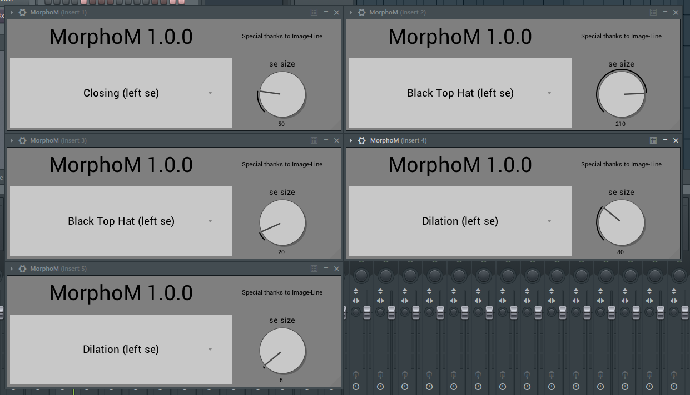

# MorphoM

MorphoM is an easy to use audio filtering VST using morphological operators.

If you want to know how it sounds like, try it !

### Download

* [MorphoM 1.0.0](https://github.com/Yt-trium/MorphoM/raw/master/build/MorphoM.vst3.zip)

* [Demo Project](https://github.com/Yt-trium/MorphoM/raw/master/demo/MorphoM%20Demo.flp)
  * MorphoM.vst3 is supposed to be in the folder "C:\Program Files\Common Files\VST3\"

### Changelog

#### Version 1.0.0
First version of MorphoM
* 6 operators (dilation, erosion, opening, closing, white top hat, black top hat)
* 1 structural element (flat left line)
* very basic user interface

### Special Thanks

Special thanks to [Image-Line](https://www.image-line.com/flstudio/)

